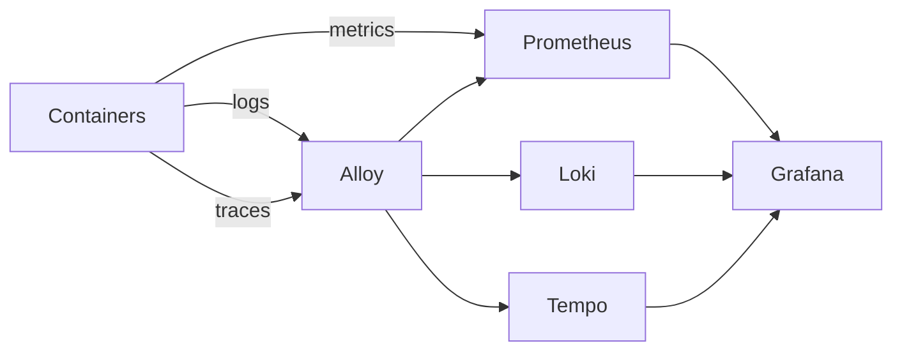
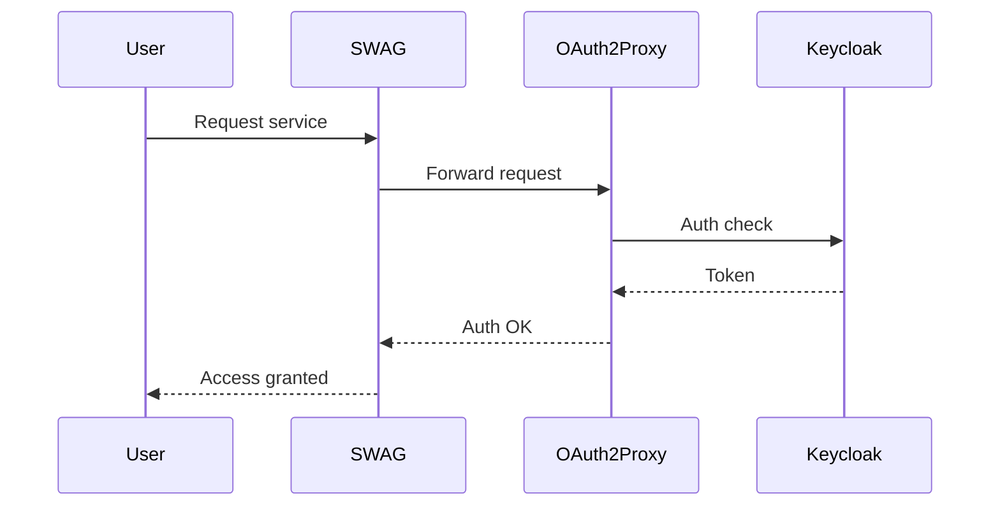

# 🔐 Observability & Platform Stack (Docker Compose)

This repository provides a **self-hosted platform stack** designed for:

- Homelab environments
- Personal servers
- Small dev / staging platforms
- Future extensible architectures (Supabase, geospatial platforms, etc.)

It combines:

- Reverse proxy & TLS
- Authentication (SSO)
- Container management
- Full observability (metrics, logs, traces)
- Data access & persistence

---

# 🧭 Architecture Philosophy

This stack is built in **two distinct phases**:

## 🟢 Phase 1 — Platform Foundation (current)

Goal: build a **stable, observable, production-ready base**

Includes:

- Reverse proxy (SWAG)
- Core services (Grafana, Portainer, Homer, Filebrowser)
- Observability stack (Prometheus, Loki, Tempo, Alloy)
- Metrics, logs, dashboards, alerting

⚠️ Tracing is **prepared but not fully activated yet**

---

## 🔐 Phase 2 — Security & Distributed Tracing (next)

Goal: enable **real-world secure flows + meaningful traces**

Includes:

- Keycloak configuration (OIDC, realms, clients)
- OAuth2 Proxy protection of services
- OTEL tracing activation on critical services
- Service Graph / Node Graph in Grafana
- Logs ↔ traces correlation

---

# 🧱 Stack Overview

## 🌐 Access & Security

- **SWAG (Nginx + Let's Encrypt)** → reverse proxy, HTTPS
- **Keycloak** → identity provider (SSO / OIDC) *(Phase 2)*
- **OAuth2 Proxy** → protects services *(Phase 2)*

---

## 🖥️ Platform Services

- **Homer** → homepage dashboard
- **Portainer** → Docker management
- **Filebrowser** → persistent data access

---

## 📊 Observability (LGTM Stack)

- **Prometheus** → metrics
- **Node Exporter** → host metrics
- **cAdvisor** → container metrics
- **Loki** → logs
- **Alloy** → logs + metrics + traces pipeline
- **Tempo** → distributed tracing backend
- **Grafana** → visualization
- **Alertmanager** → alerting

---

# 🔗 System Architecture

```mermaid
flowchart TB

flowchart TB

    Internet --> SWAG

    SWAG --> OAuth2Proxy
    SWAG --> Services

    OAuth2Proxy --> Keycloak
    Keycloak --> OAuth2Proxy

    SWAG --> Grafana
    SWAG --> Portainer
    SWAG --> Homer

    subgraph Services
        Hosted-stack
    end

    subgraph Observability
        Prometheus --> Grafana
        Loki --> Grafana
        Tempo --> Grafana
        Alloy --> Loki
        Alloy --> Tempo
        Alloy --> Prometheus
        NodeExporter --> Prometheus
        cAdvisor --> Prometheus
    end

```

---

# 🔄 Observability Flow



---

# 🔐 Authentication Flow (Phase 2)



---

# ⚙️ Prerequisites

Before deploying the stack, ensure:

| Requirement | Description |
|------------|------------|
| 🌐 Domain name | A registered domain (e.g. `example.com`) |
| 📡 DNS configured | Subdomains pointing to your server (`A` record) |
| 🐳 Docker | Installed and running |
| 🧩 Docker Compose | v2+ |
| 🔐 Open ports | 80 and 443 accessible |
| 🧠 Basic Linux knowledge | Recommended |

---

# 🚀 Deployment

## 1. Clone repository

```bash
git clone <repo>
cd <repo>
```

## 2. Generate secrets

```bash
make generate-secrets
```

(uses Makefile to generate passwords and env variables)

---

## 3. Configure environment

Edit:

```bash
.env
```

Important variables:
- domain
- emails
- credentials

---

## 4. Start the stack

```bash
make up
```

or

```bash
docker compose up -d
```

---

## 5. Access services

| Service | URL |
|--------|-----|
| Grafana | https://admin.YOUR_DOMAIN/grafana |
| Portainer | https://admin.YOUR_DOMAIN/portainer |
| Homer | https://admin.YOUR_DOMAIN/ |
| Alertmanager | https://admin.YOUR_DOMAIN/alertmanager |

---

# 📊 Dashboards & Observability

Phase 1 provides:

- Service health overview
- CPU / RAM / disk monitoring
- Container metrics
- Logs exploration (Loki)
- Alerting

Phase 2 will add:

- Distributed tracing (Tempo)
- Service graph
- Node graph
- Full request flow visibility

---

# 📁 Project Structure

```text
.
├── docker-compose.yml
├── grafana/
├── swag/
├── homer/
├── docs/
├── Makefile
└── README.md
```

---

# 📚 Documentation

Additional docs available in:

- `./docs/security.md`
- `./docs/observability.md`
- `./docs/networking.md`
- `./docs/deployment.md`

---

# 🧩 Design Principles

- **Observability-first**
- **Composable architecture**
- **Minimal external dependencies**
- **Production-like local setup**
- **Clear separation of concerns**

---

# 🚧 Roadmap

## Phase 1 (current)
- [x] Core platform
- [x] Metrics + logs
- [x] Dashboards
- [x] Alerting
- [x] Trace pipeline ready

## Phase 2 (next)
- [ ] Keycloak full configuration
- [ ] OAuth2 Proxy protection
- [ ] OTEL tracing activation
- [ ] Service graph
- [ ] Node graph
- [ ] Logs ↔ traces correlation

---

# 🧠 Summary

This stack turns Docker into a **mini platform**:

- Access → SWAG
- Security → Keycloak + OAuth2 *(Phase 2)*
- Services → Grafana, Portainer, Homer
- Observability → Prometheus + Loki + Tempo
- Data → persistent volumes + Filebrowser

➡️ Ready for future expansion:
- Supabase backend
- Geospatial platform
- Custom APIs
