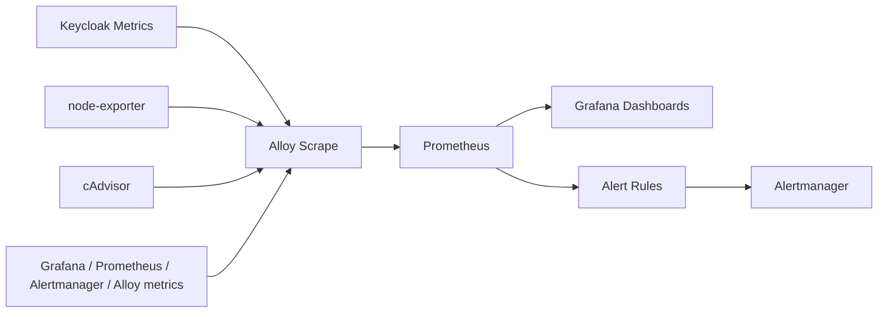
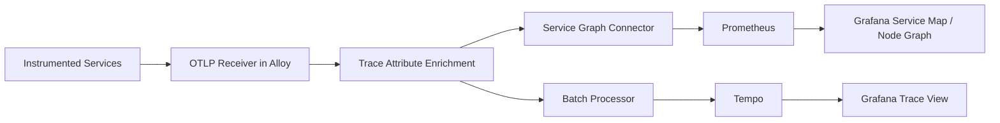
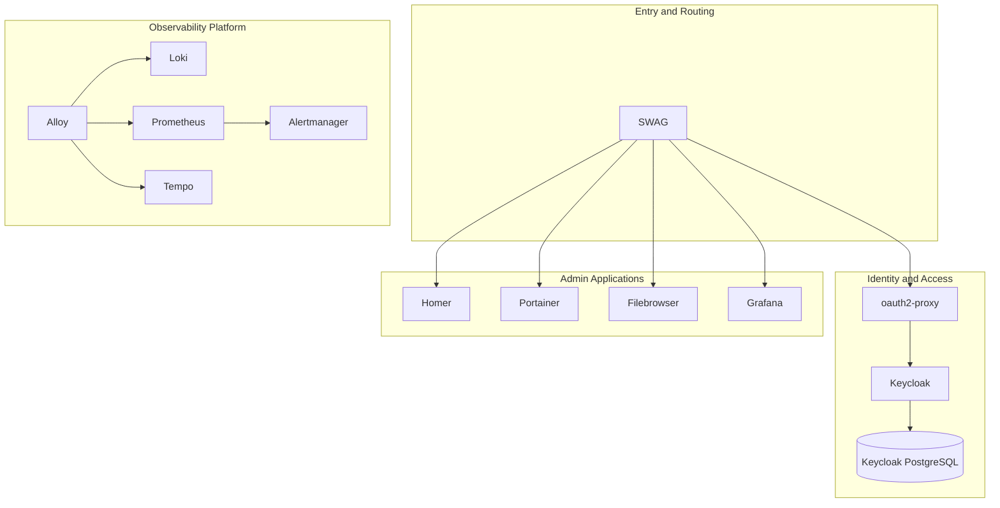

# Observability Architecture — Reverse Proxy Zone

## Purpose

This document explains the observability architecture of the **reverse proxy zone** and the logic behind its configuration.

The design deliberately separates the three telemetry chains:

- **Logs** → operational investigation and event inspection
- **Metrics** → health, capacity, trends, alerting
- **Traces** → request flow, dependency analysis, service map

Although these signals are connected in Grafana, they serve different goals and follow different pipelines.

---

## Scope

This document currently covers the base infrastructure stack:

- SWAG
- Keycloak
- Keycloak PostgreSQL
- oauth2-proxy
- Homer
- Portainer
- Grafana
- Loki
- Prometheus
- Alloy
- Tempo
- node-exporter
- cAdvisor
- Alertmanager
- Filebrowser

---

## High-Level Architecture

```mermaid
flowchart LR
    subgraph Users["Users / Browsers"]
        U[User]
    end

    subgraph Access["Access Zone"]
        SWAG[SWAG Reverse Proxy]
        OAUTH[oauth2-proxy]
        KC[Keycloak]
        KCPG[(Keycloak PostgreSQL)]
        HOMER[Homer]
        PORTAINER[Portainer]
        FB[Filebrowser]
        GRAFANA[Grafana]
    end

    subgraph Telemetry["Telemetry Backends"]
        ALLOY[Grafana Alloy]
        LOKI[Loki]
        PROM[Prometheus]
        TEMPO[Tempo]
        ALERT[Alertmanager]
    end

    subgraph Infra["Host Telemetry"]
        NODEX[node-exporter]
        CADV[cAdvisor]
    end

    U --> SWAG
    SWAG --> OAUTH
    OAUTH --> KC
    KC --> KCPG

    SWAG --> HOMER
    SWAG --> PORTAINER
    SWAG --> FB
    SWAG --> GRAFANA

    ALLOY --> LOKI
    ALLOY --> PROM
    ALLOY --> TEMPO

    NODEX --> ALLOY
    CADV --> ALLOY

    GRAFANA --> LOKI
    GRAFANA --> PROM
    GRAFANA --> TEMPO
    GRAFANA --> ALERT
  ```

## Functional Separation

The architecture is intentionally split into three functional telemetry chains.

### 1. Logs chain

Goal: inspect events, errors, access attempts, container output, and service-specific incidents.

Main path:

Docker containers write logs
Alloy discovers containers and collects Docker logs
Alloy enriches log streams with labels
Alloy forwards logs to Loki
Grafana queries Loki for investigation and filtering

### 2. Metrics chain

Goal: monitor health, performance, capacity, resource usage, and alerts.

Main path:

Prometheus-compatible endpoints expose metrics
Alloy scrapes infrastructure and service metrics
Alloy remote-writes metrics to Prometheus
Grafana uses Prometheus for dashboards
Alertmanager handles alert routing

### 3. Traces chain

Goal: understand request paths, service dependencies, latency propagation, and service mapping.

Main path:

Services emit OTLP traces
Alloy receives traces on OTLP gRPC/HTTP
Alloy enriches trace resource attributes
Alloy sends traces to Tempo
Alloy also derives service graph metrics from traces
Prometheus stores those service graph metrics
Grafana uses Tempo + Prometheus to build trace views and service maps

## Telemetry Chains

### Logs chain

```mermaid
flowchart LR
    C[Docker Containers] --> D[Docker Discovery]
    D --> A[Alloy Log Pipeline]
    A --> E[Log Label Enrichment]
    E --> L[Loki]
    L --> G[Grafana Explore / Dashboards]
```

### Metric chain



### Traces chain



## Configuration logic

*Why Alloy is the central collector*

Alloy is used as the central observability entry point because it can:

discover Docker containers
collect logs
scrape metrics
receive OTLP traces
enrich telemetry
forward each signal to the correct backend

This keeps the architecture consistent and makes future multi-stack expansion easier.

*Why logs, metrics, and traces are kept separate*

They answer different questions:

| Signal  | Main question                                     | Typical use                                            |
| ------- | ------------------------------------------------- | ------------------------------------------------------ |
| Logs    | **What happened?**                                | Error messages, access logs, audit trails              |
| Metrics | **Is the system healthy?**                        | CPU, memory, latency trends, saturation, alerts        |
| Traces  | **How did this request move through the system?** | Dependency analysis, bottleneck isolation, service map |

## Mapping table

### Components and responsibilities

| Component           | Role                          | Signal Type                                 | Input                                 | Output                           | Main Purpose                         |
| ------------------- | ----------------------------- | ------------------------------------------- | ------------------------------------- | -------------------------------- | ------------------------------------ |
| SWAG                | Reverse proxy                 | Logs, later traces if instrumented upstream | User HTTP traffic                     | Container logs                   | Entry point to admin zone            |
| oauth2-proxy        | Auth proxy                    | Logs, traces if instrumented                | Proxied auth requests                 | Container logs, OTLP traces      | Authentication gateway               |
| Keycloak            | Identity provider             | Logs, metrics, traces if enabled            | Auth flows                            | Metrics endpoint, logs, traces   | Identity and SSO                     |
| Keycloak PostgreSQL | Database                      | Logs, infra metrics                         | SQL activity                          | DB logs, container metrics       | Persistence for Keycloak             |
| Homer               | Portal                        | Logs                                        | HTTP requests                         | Container logs                   | Service landing page                 |
| Portainer           | Ops UI                        | Logs                                        | Admin requests                        | Container logs                   | Container management                 |
| Filebrowser         | File UI                       | Logs                                        | Admin requests                        | Container logs                   | Data browsing                        |
| node-exporter       | Host metrics exporter         | Metrics                                     | Host OS                               | Prometheus metrics               | Host-level telemetry                 |
| cAdvisor            | Container metrics exporter    | Metrics                                     | Docker runtime                        | Prometheus metrics               | Container resource telemetry         |
| Alloy               | Collector / processor         | Logs, metrics, traces                       | Docker, OTLP, metrics endpoints       | Loki, Prometheus, Tempo          | Central telemetry pipeline           |
| Loki                | Log backend                   | Logs                                        | Alloy                                 | Grafana queries                  | Log storage and search               |
| Prometheus          | Metrics backend               | Metrics                                     | Alloy remote write                    | Grafana queries, alerts          | Metrics storage and alert evaluation |
| Tempo               | Trace backend                 | Traces                                      | Alloy                                 | Grafana trace exploration        | Trace storage                        |
| Alertmanager        | Alert routing                 | Metrics alerts                              | Prometheus alerts                     | Notifications                    | Alert dispatch                       |
| Grafana             | Visualization and correlation | All                                         | Loki, Prometheus, Tempo, Alertmanager | Dashboards, Explore, service map | Unified observability UI             |

### Alloy mapping

| Alloy Block                                    | Function                     | Purpose                                                              |
| ---------------------------------------------- | ---------------------------- | -------------------------------------------------------------------- |
| `discovery.docker "containers"`                | Docker discovery             | Finds running containers                                             |
| `discovery.relabel "docker_logs"`              | Log target relabeling        | Converts Docker metadata into useful labels                          |
| `loki.source.docker "containers"`              | Docker log ingestion         | Reads logs from Docker                                               |
| `loki.process "docker"`                        | Log processing               | Adds normalized labels such as stack, service, role, env, host       |
| `loki.write "default"`                         | Log export                   | Sends logs to Loki                                                   |
| `prometheus.scrape "infra"`                    | Metrics scrape               | Collects metrics from infrastructure and services                    |
| `prometheus.remote_write "prometheus"`         | Metrics export               | Sends scraped metrics to Prometheus                                  |
| `otelcol.receiver.otlp "default"`              | Trace ingestion              | Receives OTLP traces on gRPC and HTTP                                |
| `otelcol.processor.attributes "traces_enrich"` | Trace enrichment             | Adds common resource attributes such as environment, host, namespace |
| `otelcol.connector.servicegraph "default"`     | Service graph generation     | Builds service dependency metrics from traces                        |
| `otelcol.processor.batch "default"`            | Trace batching               | Buffers traces before export                                         |
| `otelcol.exporter.otlp "tempo"`                | Trace export                 | Sends traces to Tempo                                                |
| `otelcol.exporter.prometheus "servicegraph"`   | Service graph metrics export | Sends derived service graph metrics to Prometheus                    |


### Labelling strategy

#### Core labels

| Label     | Meaning              | Example         |
| --------- | -------------------- | --------------- |
| `stack`   | Logical stack name   | `zone-proxy`    |
| `domain`  | Functional domain    | `admin`         |
| `service` | Logical service name | `keycloak`      |
| `role`    | Functional role      | `iam`           |
| `env`     | Environment          | `prod`          |
| `host`    | Hostname             | `homeserver-01` |

#### Docker labels used as source of truth

| Docker Label  | Observability Label |
| ------------- | ------------------- |
| `obs.stack`   | `stack`             |
| `obs.domain`  | `domain`            |
| `obs.service` | `service`           |
| `obs.role`    | `role`              |
| `obs.env`     | `env`               |

#### Logical Service Grouping



## Service Map Readiness Model

A clean service map does not appear automatically from container logs alone.

*Level 1 — Foundational observability*
Logs are collected
Metrics are scraped
Labels are normalized
Grafana dashboards work

*Level 2 — Trace-enabled services*
One or more services emit OTLP traces
Trace resource attributes are normalized
Tempo receives traces
Trace search becomes usable

*Level 3 — Service graph and dependency view*
Trace context is propagated across service calls
Alloy generates service graph metrics
Prometheus stores service graph metrics
Grafana can render a real service map

### Current architectural intent

The reverse proxy zone should be understood as two parallel structures:

*A. Logical architecture*

This is the human-readable architecture used in documentation:

Entry and routing
Identity and access
Admin applications
Observability platform

*B. Telemetry architecture*

This is the signal-processing architecture:

Logs chain
Metrics chain
Traces chain

The documentation should keep both views because they answer different needs:

* the logical architecture explains the platform
* the telemetry architecture explains observability behavior

## Recommended Documentation Rule

For every new stack added later, document it using the same structure:

*1. Logical services*
*2. Logs chain*
*3. Metrics chain*
*4. Traces chain*
*5. Labels*
*6. Expected service map scope*

This keeps the documentation consistent across:

reverse proxy zone
geospatial platform
Supabase backend
future application stacks